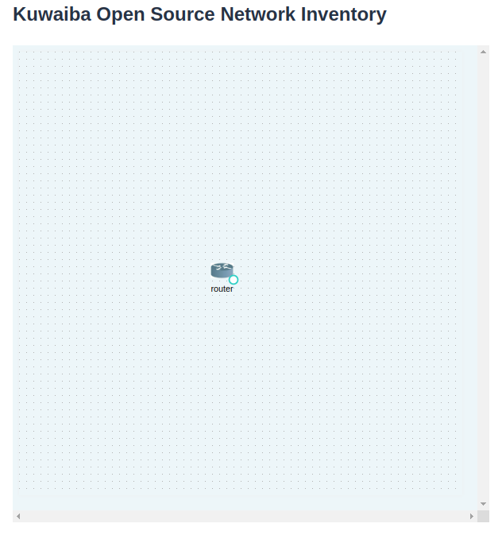

# vaadin-flow-x6
This repository contains a Vaadin Flow add-on for the web component for the popular Javascript diagramming library X6 (also developed by Neotropic SAS)

The project that containing the x6 web component can be found in the following repository: [X6 Web Component](https://github.com/NeotropicSAS/webcomponent-x6)

In the web component project, you can perform tests or add functionalities.

> **Note:**
> 
> If you make modifications to the TypeScript file (x-6.ts) of the web component, please remember to replace it in the location where this file is found in the x6 add-on.
>

The TypeScript file (`x-6.ts`) for the web component can be found at the following location in the X6 add-on:

- x6-flow-root/x6-flow/src/main/resources/META-INF/resources/frontend/src/`x-6.ts`

## Requirement:
- Make sure you have Maven installed.
- Ensure you are using **Java 11**.
  
> **Note:**
> 
>You can use your preferred IDE to execute the project by performing a "Clean and Build," and then running the program. However, if you prefer to execute it through the terminal, continue with the tutorial.
>

  
## Running the component demo

1. Navigate to the x6-flow project.
   
    ```bash
        cd x6-flow-root/x6-flow
    ```

2. Execute Maven for x6 Add-on project:
   
    > **Note:**
    >
    >If Java 11 is not set as your primary Java version, configure it as an environment variable:
    >
    > ```bash
    >   export JAVA_HOME=/ROUTE-TO-YOUR-JAVA11/
    >   PATH=$JAVA_HOME/bin:$PATH
    >   java --version # Check your Java version
    >```

    ```bash
        mvn clean install --no-transfer-progress
    ```

3. Navigate to the x6-flow-demo project.
   
    ```bash
        cd x-flow-root/x6-flow-demo
    ```

4. execute maven for X6 demo project:
   
    ```bash
        mvn clean install --no-transfer-progress
    ```

5. Run your application.

    ```bash
        mvn exec:java -Dexec.mainClass=com.neotropic.flow.component.antvx6.demo.Application
    ```
   
    you'll be able to find the demo at: http://localhost:8080/

    | |
    |:--:|
    | ***X6 Component Demo for Vaadin Flow*** |


    > **Note:**
    >
    > If you need to use the add-on in another Spring Boot application, simply add the dependency to that application's pom.xml:
    >
    > ```bash
    >    <dependency>
    >       <groupId>com.neotropic.flow.component</groupId>
    >       <artifactId>x6-flow</artifactId>
    >       <version>1.0</version>
    >       <type>jar</type>
    >    </dependency>
    >```
    >